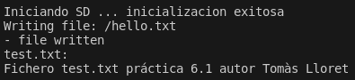

# PRACTICA 6: BUSOS DE COMUNICACIÓ 2
### Autor: Tomàs Lloret

L'objectiu d'aquesta pràctica és entendre el funcionament dels busos SPI, aprendre a utilitzar-los per a llegir i escriure fitxers en una memòria SD i aprendre també el seu ús per a la lectura de targetes RFID.

## Part A: Lectura i escriptura en una memòria SD
Comencem com sempre incloent les llibreries necessàries per al funcionament correcte del codi, en aquest cas Arduino.h, SPI.h i SD.h.
```c
#include <Arduino.h>
#include <SPI.h>
#include <SD.h>

File myFile;
```

Desprès definim una funció anomenada writeFile(), que agafa el sistema d'arxius fs, la ruta i nom del arxiu i el text que va dins d'aquest.
```c
//funcion para escribir archivo
void writeFile(fs: :FS &fs, const char * path, const char *)
{
  Serial.printf("Writing file: %s \n", path);
  File file = fs.open(path, FILE_WRITE);
  if(!file){
    Serial.println("- failed to open file for writing");
    return;
  }
  else if(file.print(message)){
    Serial.println("- file written");
  }
  else(){
    Serial.println("- the writing of the file failed");
  }
  file.close();
}
```

Finalment, a dins del setup iniciem la comunicació serial, configurem la comunicaciío SPI i intentem inicialitzar la targeta SD. Si aquesta va bé, creem un arxiu anomenat "hello.txt" autilitzant la funció writeFile() definida anteriorment i després s'intenta obrir i mostrar el contingut de l'arxiu anomenat "test.txt".
```c
void setup()
{
  Serial.begin(115200);
  Serial.print("Iniciando SD ...");
  SPI.begin(36, 37, 35);
  if (!SD.begin(5)) {
    Serial.println("No se pudo inicializar");
    return;
  }
  Serial.println("inicializacion exitosa");

  WriteFile(SD, "/hello.txt", "Texto a escribir, PD 2024")//escribimos el archivo

  myFile = SD.open("archivo.txt");//abrimos el archivo 
  if (myFile) {
    Serial.println("archivo.txt:");
    while (myFile.available()) {
    	Serial.write(myFile.read());
    }
    myFile.close(); //cerramos el archivo
  } else {
    Serial.println("Error al abrir el archivo");
  }
}
```

### Part A: Codi complet
```c
#include <Arduino.h>
#include <SPI.h>
#include <SD.h>

File myFile;

//funcion para escribir archivo
void writeFile(fs: :FS &fs, const char * path, const char *)
{
  Serial.printf("Writing file: %s \n", path);
  File file = fs.open(path, FILE_WRITE);
  if(!file){
    Serial.println("- failed to open file for writing");
    return;
  }
  else if(file.print(message)){
    Serial.println("- file written");
  }
  else(){
    Serial.println("- the writing of the file failed");
  }
  file.close();
}

void setup()
{
  Serial.begin(115200);
  Serial.print("Iniciando SD ...");
  SPI.begin(36, 37, 35);
  if (!SD.begin(5)) {
    Serial.println("No se pudo inicializar");
    return;
  }
  Serial.println("inicializacion exitosa");

  WriteFile(SD, "/hello.txt", "Texto a escribir, PD 2024")//escribimos el archivo

  myFile = SD.open("archivo.txt");//abrimos el archivo 
  if (myFile) {
    Serial.println("archivo.txt:");
    while (myFile.available()) {
    	Serial.write(myFile.read());
    }
    myFile.close(); //cerramos el archivo
  } else {
    Serial.println("Error al abrir el archivo");
  }
}

void loop()
{
  
}
```

### Part A: Funcionament

En aquesta imatge veiem els prints del terminal on es veu l'inicialització de la targeta SD, la creació de 'hello.txt' i la mostra del contingut de 'test.txt' per terminal.

## Part B: Lectura d'etiqueta RFID
Comencem el codi incloent les llibreries necessaries (Arduino.h, SPI.h i la del perifèric, MFRC522.h) i definint els pins. El pin 22 servirà per al reset del MFRC522 i el 21 per a la informació SDA del mòdul. Finalment, definim un objecte per al dispositiu en el que incloem els dos pins definits anteriorment.
```c
#include <Arduino.h>
#include <SPI.h>
#include <MFRC522.h>

#define RST_PIN	22   //Pin 0 para el reset del RC522
#define SS_PIN	21   //Pin 2 para el SS (SDA) del RC522
MFRC522 mfrc522(SS_PIN, RST_PIN); //Creamos el objeto para el RC522
```

Dins del setup declarem la velocitat de comunicació en 115200 ms, iniciem el bus SPI amb SPI.begin() i el mòdul RFID amb mfrc522.PCD_Init(). Finalment, enviem un missatge per terminal que indica l'inici de la "Lectura de l'UID".
```c
void setup() {
	Serial.begin(115200); //Iniciamos la comunicación  serial
  delay(100);
  Serial.println("Test.");
	SPI.begin(18,19,23);        //Iniciamos el Bus SPI
  Serial.println("Test2");
	mfrc522.PCD_Init(); // Iniciamos  el MFRC522
	Serial.println("Lectura del UID");
}
```

Dins del loop, revisem si hi ha alguna nova targeta detectada per l'MFRC522. Si la resposta es afirmativa, s'entra en una segona iteració if que selecciona la targeta i que amb un for, ens envia de forma serial l'UID d'aquesta. Finalment acabem la lectura de la targeta actual amb la funció mfrx522.PICC_HaltA().
```c
void loop() {
	// Revisamos si hay nuevas tarjetas  presentes
	if ( mfrc522.PICC_IsNewCardPresent()) 
        {  
  		//Seleccionamos una tarjeta
            if ( mfrc522.PICC_ReadCardSerial()) 
            {
                  // Enviamos serialemente su UID
                  Serial.print("Card UID:");
                  for (byte i = 0; i < mfrc522.uid.size; i++) {
                          Serial.print(mfrc522.uid.uidByte[i] < 0x10 ? " 0" : " ");
                          Serial.print(mfrc522.uid.uidByte[i], HEX);   
                  } 
                  Serial.println();
                  // Terminamos la lectura de la tarjeta  actual
                  mfrc522.PICC_HaltA();         
            }      
	}	
}
```

### Part B: Codi complet
```c
#include <Arduino.h>
#include <SPI.h>
#include <MFRC522.h>

#define RST_PIN	22   //Pin 0 para el reset del RC522
#define SS_PIN	21   //Pin 2 para el SS (SDA) del RC522
MFRC522 mfrc522(SS_PIN, RST_PIN); //Creamos el objeto para el RC522

void setup() {
	Serial.begin(115200); //Iniciamos la comunicación  serial
  delay(100);
  Serial.println("Test.");
	SPI.begin(18,19,23);        //Iniciamos el Bus SPI
  Serial.println("Test2");
	mfrc522.PCD_Init(); // Iniciamos  el MFRC522
	Serial.println("Lectura del UID");
}

void loop() {
	// Revisamos si hay nuevas tarjetas  presentes
	if ( mfrc522.PICC_IsNewCardPresent()) 
        {  
  		//Seleccionamos una tarjeta
            if ( mfrc522.PICC_ReadCardSerial()) 
            {
                  // Enviamos serialemente su UID
                  Serial.print("Card UID:");
                  for (byte i = 0; i < mfrc522.uid.size; i++) {
                          Serial.print(mfrc522.uid.uidByte[i] < 0x10 ? " 0" : " ");
                          Serial.print(mfrc522.uid.uidByte[i], HEX);   
                  } 
                  Serial.println();
                  // Terminamos la lectura de la tarjeta  actual
                  mfrc522.PICC_HaltA();         
            }      
	}	
}
```